## Orders API 

Este proyecto es una API REST para la gestión de órdenes, desarrollada con Java y Spring Boot, y diseñada para comunicar eventos a
través de Kafka. Todos los servicios se orquestan con Docker para facilitar su ejecución y despliegue. 

## 🧰 Requisitos 

Docker
Docker Compose
git para clonar el repositorio 


## 🚀 Ejecución rápida con Docker 
1. Clona el repositorio 
```bash
git clone https://github.com/sergiohdezchi/orders-service.git
cd orders-service
```
2. 🐳 Levantar la aplicación con Docker

```bash
docker compose up --build
```

## API

### Apuntar a la API
```bash
http://localhost:8081
```
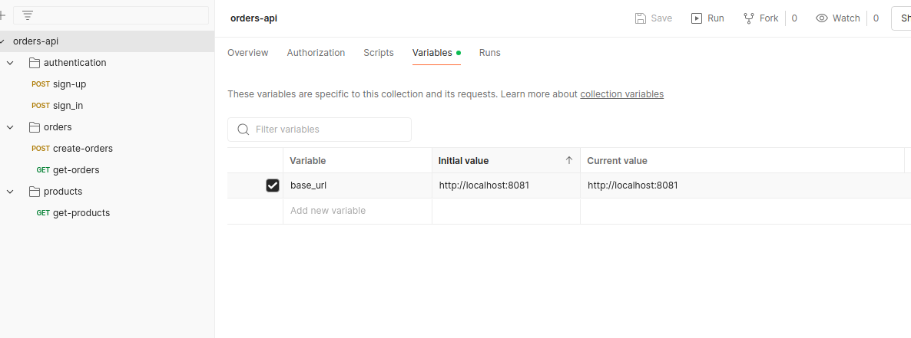

### Registrar Usuario en el Endpoint
```bash
POST {{base_url}}/auth/sign-up
```

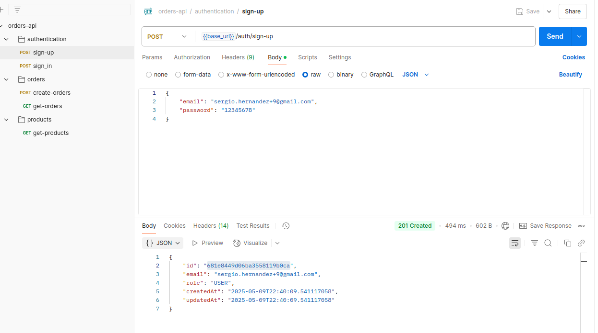

### Login con el usuario registrado
```bash
POST {{base_url}}/auth/sign-up

{
    "email": "sergio.hernandez+9@gmail.com",
    "password": "12345678"
}
```
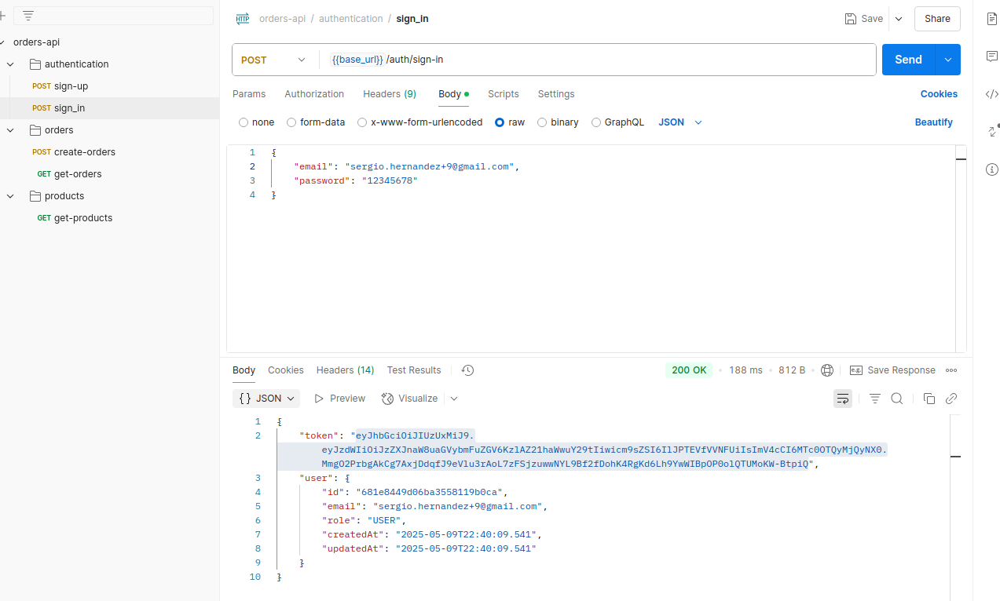

### Copiar token

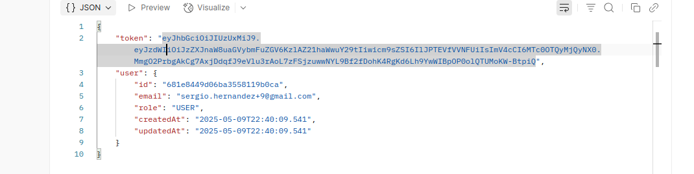

### Usar token como Bearer Token

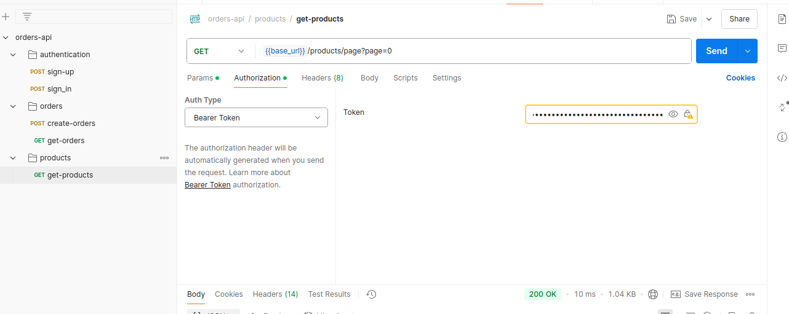

### Usar Endpoint para obtener la lista de productos

```bash
GET {{base_url}}/products/page?page=0
```
En query params puedes usar page para el numero de pagina

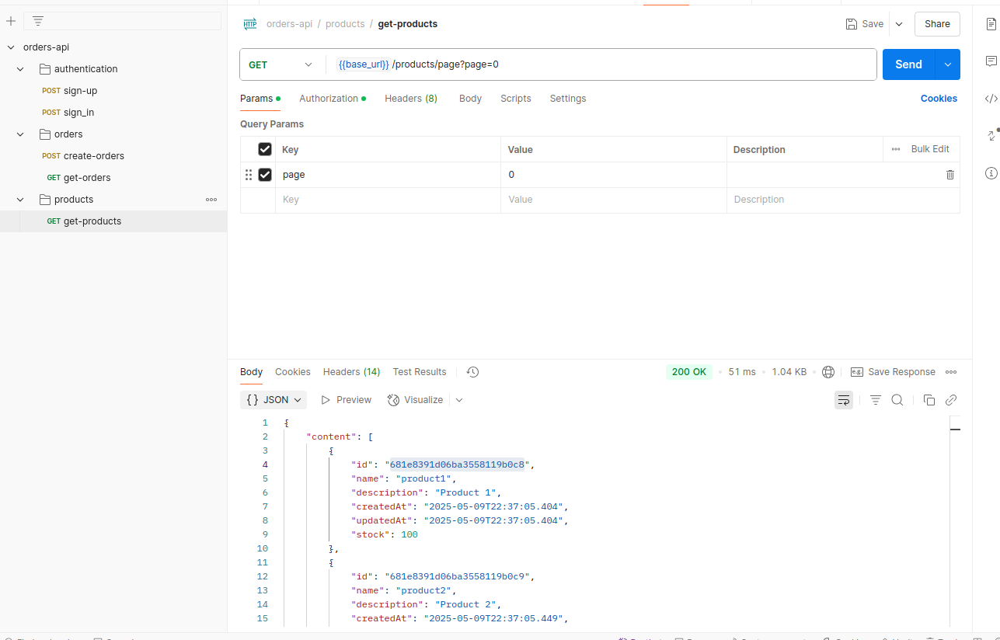

### Copiar el ID del producto
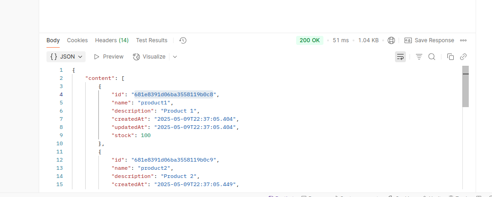

### Crear Orden
```bash
POTS {{base_url}}/orders

{
    "items": [
        {
            "id": "681e8391d06ba3558119b0c8",
            "quantity": 2
        }
    ]
}
```
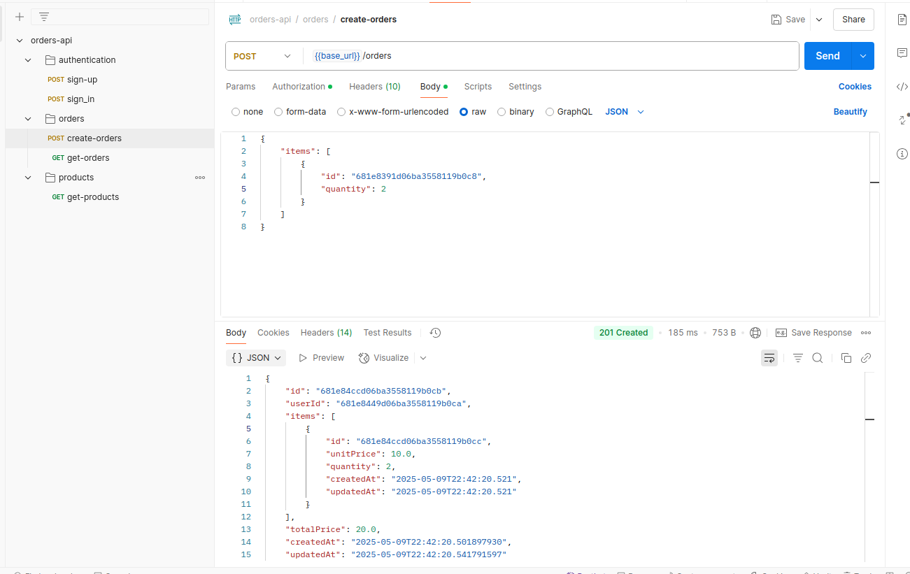


### Rervisar el mensaje que imprime el consumer como prueba

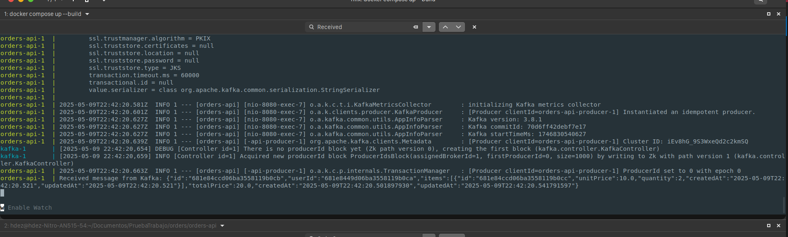

### Listar Ordenes
Puedes usar page para navegar entre paginas y userId para filtrar por usuario

```bash
GET {{base_url}}/orders/page?page=0&userId=681e8449d06ba3558119b0ca
```

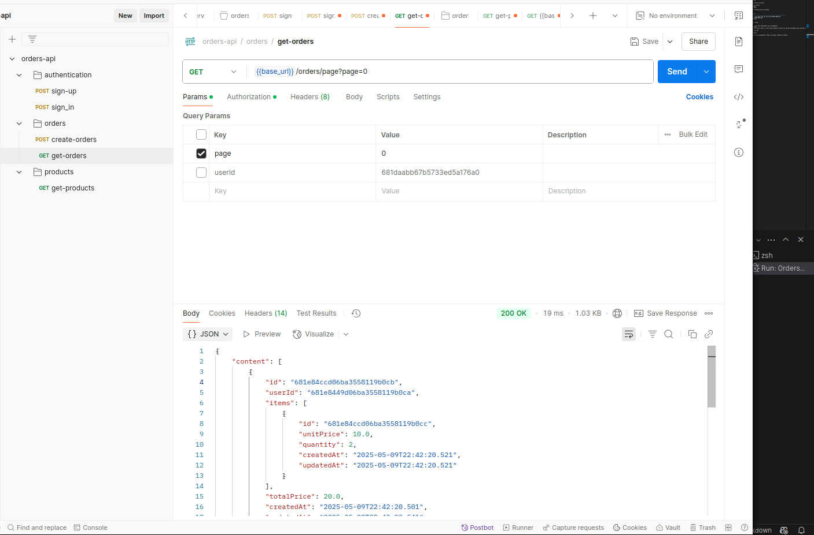

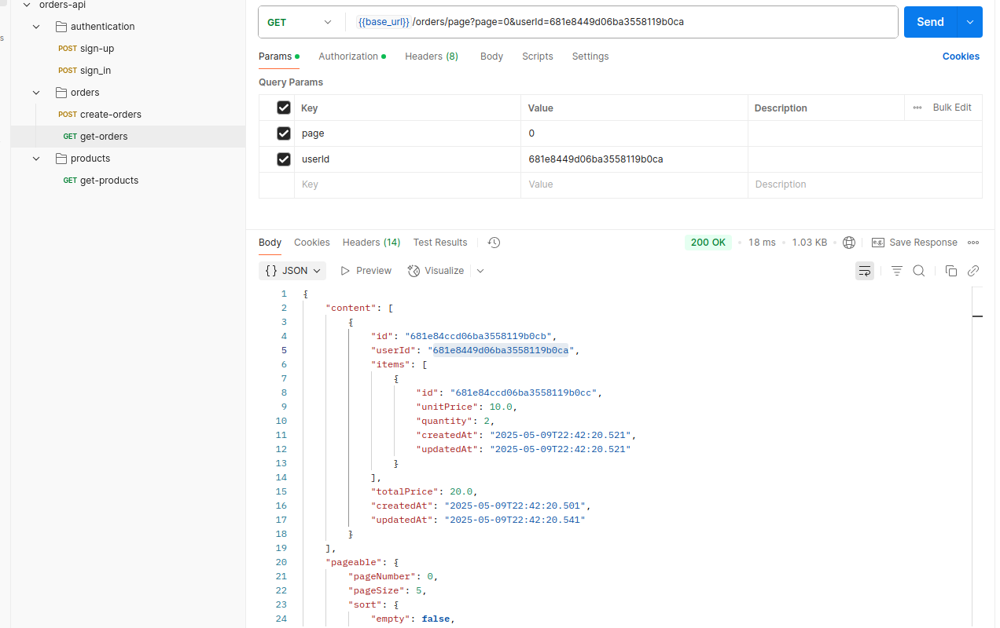

### Recompilar  el proyecto en caso de ser necesario

```bash
mvn clean package -Dspring.profiles.active=default
```

